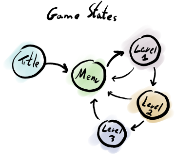
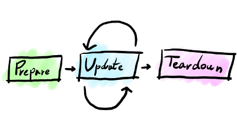

#<cldoc:Cage Overview>
Read about the basics of Cage

## Game Structure

### Game States

Cage assumes your game has a state. A game state
can be its title screen, main menu or any one of your
game's levels.

For each state, cage will manage a game loop for you.

The heart of the game loop will **update** the game
and draw its frames but to do so you will probably
need to **prepare** your state resources and
when the state is invalidated, **teardown** and clean
up.

### Game State Functions

To provide Cage with a valid <gamestate>, you
need to define 3 game state functions for the 3
game loop tasks:

* Prepare
* Update
* Teardown

### Game Toolbox

To help you with dealing with your game's state and resources,
cage will provide you with a "toolbox". The <toolbox> structure
contains a set of resources such as your game's screen and keyboard,
as well as a reserved spot to store your custom data.

## Sprites & Animation
Coming soon...

## Keyboard & Gamepad Input
Coming soon...

## Music & Sound Effects
Coming soon...

## Tricks & Patterns
Coming soon...

## Structs & Memory Management

Cage lets you decide how to manage your game's memory.
Resources such as <image>, <sprite> and <animation>
will usually have a set of **create** and **destroy**
functions you can use, sparing you from needing to allocate and free memory.
Alternatively, you can allocate and free structure memory by your own,
but you will need to take for any required initialization or cleanup.

For example, you can easily create and destory images like so:

    struct image* image;
    image = create_image( "res/image.png" );

    if ( image!=NULL) {
        destroy_image( image );
    }

Or, if you want, you can do:

    struct image image;
    // this will work on already allocated image structs
    if ( load_image( &image, "res/image.png" ) == -1 ) {
        // something went wrong
    }
    ...
    // clean up any internally allocated resources
    cleanup_image( &image );
