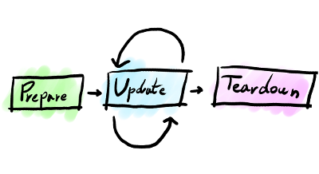
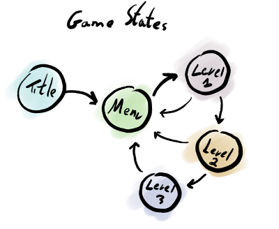

.. highlight:: c

Game essentials
===============

The heart of almost every game is the game loop. The game
loop processes events, runs the game logic and generates the
game visuals and sounds.  

game_loop
---------
.. doxygenfunction:: game_loop

To run its game loop, Cage must have a game state. The
game state is created, updated and destroyed using three pointers to three functions:

create function
--------------------
.. doxygentypedef:: create_func_t

update function
--------------------
.. doxygentypedef:: update_func_t

destroy function
--------------------
.. doxygentypedef:: destroy_func_t

The state functions share a common feature - the state data
argument.  The create function creates a state and returns
a valid data pointer. The common pattern is to
have a dedicated struct per state that holds all required
state assets. 

The update function will get the same state data pointer
back, so it is able to use it to update and draw the game.

The destroy function will also get the same user data
pointer, this time it will usually use it to clean any
allocated assets.

Games will usually have different levels, menus, high score
displays and the likes. These are represented as different
game states.

Transitioning between different states allow you
to have a more complex game structure. Use game_state() to change
the active game state using a new set of state functions:

game_state
----------
.. doxygenfunction:: game_state

For example:

::

     // These are the level state functions
     void* create_level(void)
     {
         struct level_data* data = malloc(sizeof(struct level_data));
         return level_data;
     }

     void update_level(void* data, float elapsed_ms)
     {
         // Update and draw your game
     }

     void destroy_level(void* data)
     {
         // Put any cleanup code here...
         free(data);
     }

     // These are the game menu state functions
     void* create_menu(void)
     {
         struct menu_data* data = malloc(sizeof(struct menu_data));
         return menu_data;
     }

     void update_menu(void* data, float elapsed_ms)
     {
         // Handle the menu behavior.
         // When ready, switch to the level game state:
         game_state(create_level, update_level, destroy_level);
     }

     void destroy_menu(void* data)
     {
         // Put any cleamup code here...
         free(data);
     }

     // This is your game!
     int main(int argc, char ** argv)
     {
         // Set up the initial game state
         return game_loop(create_menu, update_menu, destroy_menu);
     }

