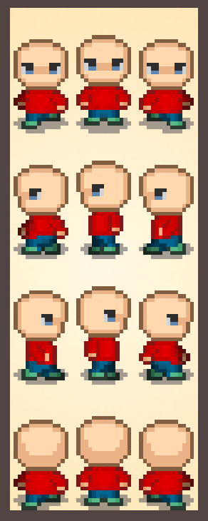

# Sprite Base
I created this RPG-inspired sprite base for the upcoming CAGE tiled
tutorial.

<<<<<<< 3c6dbb77758a8af67849eee0f5f0c06fe10d1eeb
You are free to use and customize it freely.
=======
It has different effect layers you can turn on and off. This
makes it very easy to customize and create different sprites.
>>>>>>> Updating sprite readme content.
